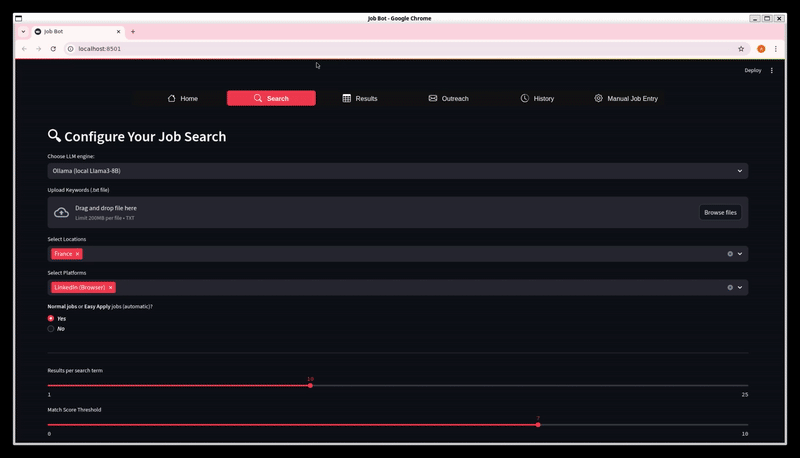

# Job‑Bot‑Multisite (Linkedin, Indeed for now) (Python 3.12)

> **What is Job-Bot-Multisite?**  
> A personal, end-to-end pipeline that turns dozens of job-board tabs and copy-pasting chores into one click.  
> Built in my free evenings (I’m a mechanical-engineering graduate with no formal CS degree and just a love for Python), it scrapes fresh listings, ranks them with an LLM, auto-tailors my CV & cover letter, and tracks every application in a single Streamlit dashboard.  
> The goal: remove ~80 % of the repetitive work so I can spend time on what actually matters—targeted outreach and continuous learning.
>
> **Disclaimer (alpha software)**  
> This project is still very much in flux and **contains plenty of rough edges and bugs**. Generated CVs/Cover Letters may need manual fixes, and different résumé templates can break the keyword-injection logic. **Use it as-is and adapt it to your own CV structure**; always proof‑read documents before sending.

---


| Feature | What it does |
|---------|--------------|
| **Streamlit dashboard** | Point‑and‑click UI for the whole workflow |
| **Keyword search** | Upload a '.txt' list **or** paste keywords |
| **Job scraping** | Indeed (API) via `jobspy` · LinkedIn (Browser) with Playwright |
| **Relevance scoring** | Local Llama 3 (via **Ollama**) *or* OpenAI GPT‑3.5 |
| **CV tailoring** | Injects keywords into `assets/templates/template_cv.docx`, keeps it 1‑page, outputs **DOCX + PDF** (extremely case sensitive and still Alpha versioned) |
| **Cover‑letter wizard** | Generates personalised cover letter (DOCX + PDF) from a template (Always recheck if no errors or badly generated letters result from the LLM reasoning) |
| **Application history** | Tracks status (Applied / Interview / Offered / Rejected) |
| **Manual entry** | Paste any job description then generate a modified CV + tailored CL |

---

## 1 · Prerequisites

| Dependency | Why | Install |
|------------|-----|---------|
| **Python 3.12** | Required runtime (use the latest patch release) | See setup below |
| **OpenAI** | Cloud LLM fallback / faster GPT-4 o. Library is already in `requirements.txt`; supply a token. | Create token → set `OPENAI_API_KEY` (see §2) |
| **Ollama** *(optional)* | Run **Llama 3-8B** locally (≈16 GB RAM, ≥8 GB VRAM). Faster offline dev. | <https://ollama.com> · `brew install ollama` / `choco install ollama` |

---

## 2 · Setup

### Recommended: Conda / Mamba env

```bash
# 0) Install Miniconda (or Mamba) once
#    https://docs.conda.io/en/latest/miniconda.html

# 1) Create & activate the env
conda create -n jobbot python=3.12
conda activate jobbot   # use "mamba" instead of "conda" if installed

# 2) Pull the code & deps
git clone https://github.com/abdelilah-eddahhaoui/job_bot_multisite.git
cd job_bot_multisite
pip install -r requirements.txt   # uses the env’s Python

# 3) Add your OpenAI key (skip if you’ll only use Ollama)
export OPENAI_API_KEY="sk-…"            # Linux/macOS
# RQ : you can also input the token directly in the App, before running the scraper
```
---

## 3 · First run

```bash
streamlit run app/main.py
```

1. **Home ▸ Profile** — fill once → saved to `config/profile.json`
2. **Place your base CV** — `assets/templates/template_cv.docx`
3. **Place your base CL** — `assets/templates/template_motivation.docx`

---

## 4 · Workflow

1. **Search** — tweak keywords, click **Start search**
2. **Results** — auto-tailor CV & CL per listing ↗ download
3. **History** — track application status (applied / interview / rejected)

---

## 5 · LLM back-ends

| Engine | How |
|--------|-----|
| **Ollama** *(default)* | Ensure `ollama run llama3` works before launch. Selected automatically if present. |
| **OpenAI API** | In **Settings ▸ LLM** select *OpenAI* and make sure `OPENAI_API_KEY` is exported or input the token on the app directly |

---

## Live demo

RQ : This video was filmed in an old version of the code, but the main steps to launch the search are still the same
<p align="center">
  
</p>

## Project tree (key folders)

```
app/                    # Streamlit UI
modules/                # CV, CL, scraping, utils
scrapers/               # Site‑specific logic
assets/templates/       # template_cv.docx, template_motivation.docx
results/                # generated docs per job
config/profile.json     # your private profile
```

---

## Acknowledgements

This project relies on  
**[JobSpy](https://github.com/adamlui/jobspy)** for its Indeed searching & parsing utilities.  


## License & usage note

Abdelilah Ed Dahhaoui (2025) — Demo data only; users **must** replace templates with their own documents.  
Because the codebase is still experimental, you may use, modify, or fork it, but do so at your own risk and always verify generated content before sending.
Templates source : https://create.microsoft.com/en-us/template/industry-manager-resume-57cae682-222c-4646-9a80-c404ee5c5d7e
